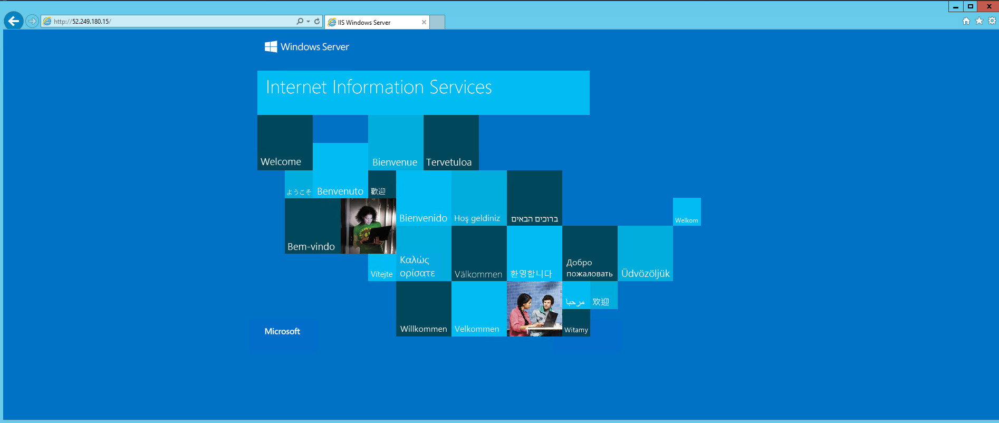
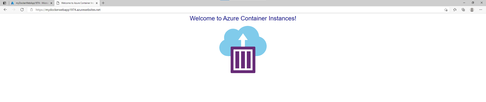
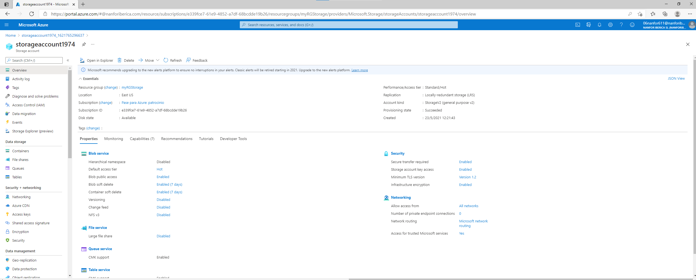
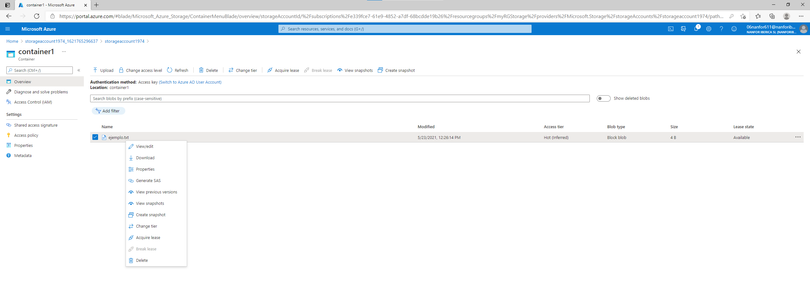
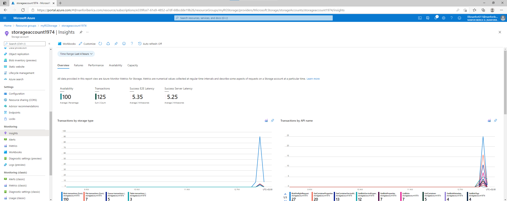

# 01- Create a virtual machine in the portal

* Máquina virtual creada

  

  

* ISS instalado

  

# 02- Create a Webb App

* Web App creada

  

# 03-Deploy Azure Container Instances

* Creación del contenedor en azure

  

* Navegando por el contenedor
* 

# 04-Create a virtual network

* Creación de la red local

* Creación de las 2 máquinas virtuales

  

* Ping entre las dos máquinas

  

# 05- Create Blob storage

* Creado el almacenamiento

  

* Subido un archivo al contenedor

  

* Métrica

  

