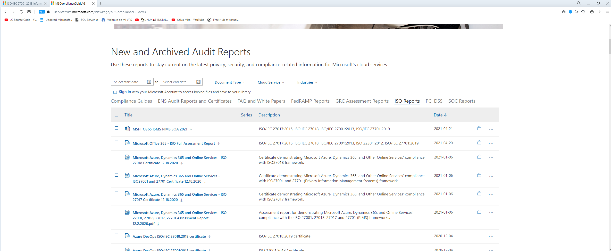

# 01- Create a virtual machine in the portal

* Máquina virtual creada

  

  

* ISS instalado

  

# 02- Create a Webb App

* Web App creada

  

# 03-Deploy Azure Container Instances

* Creación del contenedor en azure

  

* Navegando por el contenedor
* 

# 04-Create a virtual network

* Creación de la red local

* Creación de las 2 máquinas virtuales

  

* Ping entre las dos máquinas

  

# 05- Create Blob storage

* Creado el almacenamiento

  

* Subido un archivo al contenedor

  

* Métrica

  

# 06-Create a SQL database

# 07-Implement the Azure IoT Hub

# 08-Implement Azure Functions

# 09-Create a VM with a Template

# 10-Create a VM with PowerShell

# 11-Create a VM with the CLI

# 12-Implement Azure Key Vault

# 13-Secure network traffic

# 14-Manage access with RBAC

# 15-Manage resource locks

# 16-Implement resource tagging

# 17-Create an Azure Policy

# 18-Explore the Trust Center

# 19-Use the Azure Pricing Calculator

# 20-Use the Azure TCO Calculator

![(C:\practicas CTIC Azure\Evidencias\21.CalculateCompositeSLA.png)

# 21-Calculate Composite SLAs

# 22-Open a Support Request

